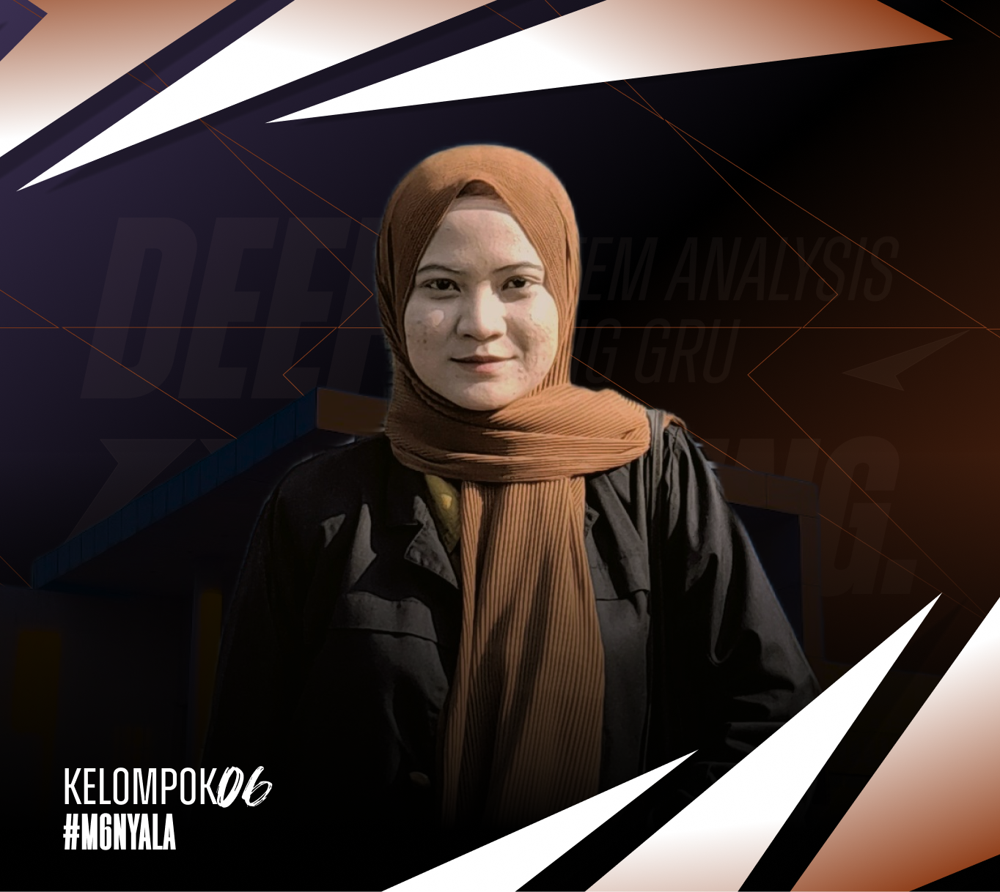

<div align="center">

<h1> Sentiment Analysis Using GRU </h1>

<!-- [](#) -->
[](#)
[](#)
</div>

## **Table Of Contents**
[Introduction]()

[Member Of Team]()

[Role & Position Member Of Team]()

[Dataset]()

[Installation Steps]()

[Documentation]()

[Presentation Video]()

## **Introduction**
This study aims to compare the performance of the BiGRU model with Att-BiGRU in analyzing sentiment on movie review data. This study not only provides insight into the advantages of the Attention mechanism in improving model performance, but also contributes to the development of more effective sentiment analysis methods for data with complex characteristics such as movie reviews.

## **Member Of Team**

|  [<br /><sub><b>Kevin Simorangkir</b></sub>](https://github.com/kevinsimorangkir21)<br /> 121140150 <br /> | [<br /><sub><b>Husni Na'fa Mubarok</b></sub>](https://github.com/nafamubarokhusni)<br />121140037 <br /> | [<br /><sub><b>Ramadhita Atifa</b></sub>](https://github.com/ramadhitatifa)<br /> 121450131 <br /> | [<br /><sub><b>Mayada</b></sub>](https://github.com/awesomemaya1)<br />121450145 <br /> |
|--|--|--|--|

## **ID & Position Member Of Team**
<div align="left">

| Name | ID Student | Position
| :---: | :---: | :---: |
| Kevin Simorangkir     | 121140150 | Chairman |
| Husni Na'fa Mubarok   | 121450078 | Member |
| Dwi Sulistiani        | 121450079 | Member |
| Ramadhita Atifa Hendri| 121450131 | Member |
| Mayada                | 121450145 | Member |

</div>

## **Dataset**
The dataset used in the research on Sentiment Analysis Using GRU is a Film Review consisting of 5000 data that has been obtained. The dataset can be downloaded via the link below:

```bash
https://bit.ly/Dataset-ReviewFilm
```

##   **Installation Steps**
### **Preparation of Needs**
Some of the preparations needed to carry out this research project are as follows:

<li> Install python software/code first </li>

```bash
https://www.python.org/downloads/
```

<li> After installing, first check whether Python has been installed properly using the following command: </li>

```bash
python --version
```

<li> Once the python version appears, please open a text editor that supports it such as Visual Studio Code and the web-based Google Collab. Here are the links to use both (please download and install):</li>

```bash
[Software VISUAL STUDIO CODE](https://code.visualstudio.com/)
```
  
```bash
[Software GOOGLE COLLAB](https://colab.research.google.com/)
```

### **Program Running Stage**

<li> Open a terminal / something like GitBash etc. Please clone this Repository by following the following command and copy it in your terminal:</li>

```bash
https://github.com/kevinsimorangkir21/Sentiment-Analysis-Using-GRU.git
```

<li> Please change the directory to point to the clone folder with the following command:</li>

```bash
cd Sentiment-Analysis-Using-GRU
```

<li> Next step, open the text editor that you have that supports python language. Please direct your cursor to the Analysis GRU.ipynb file.</li>

<li> Please click <b>Run All (On Visual Studio Code)</b> and <b>Runtime -> Run All (On Google Collab)<b\>. Then the program will run successfully.</li>

<!-- ## **UML Diagram**

### The following is the UML diagram in this LOST game which has been arranged in a perfect structure according to the plot :


## **Screenshots**
### The following is the appearance of the game in this LOST game which has been arranged with a perfect structure according to the plot :


## **Video Demo Game LOST**
[](https://www.youtube.com/watch?v=H1RpdxTeuoE) -->
